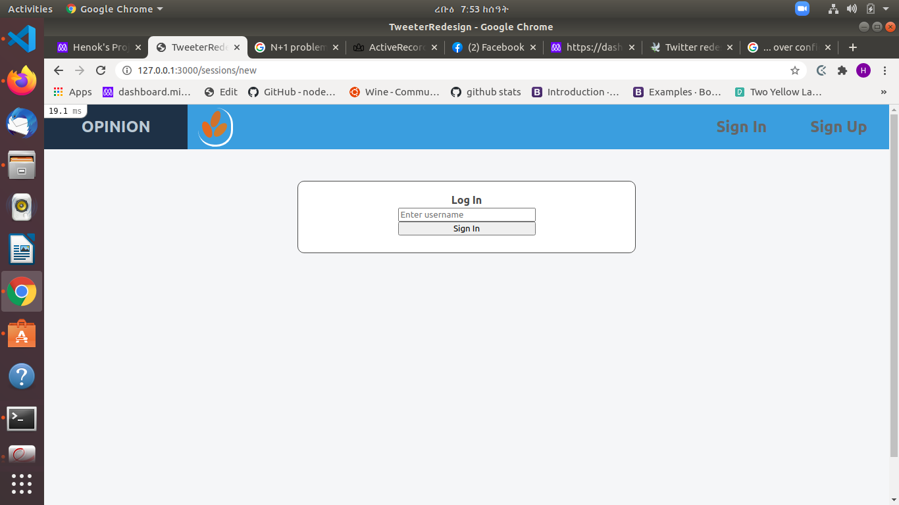
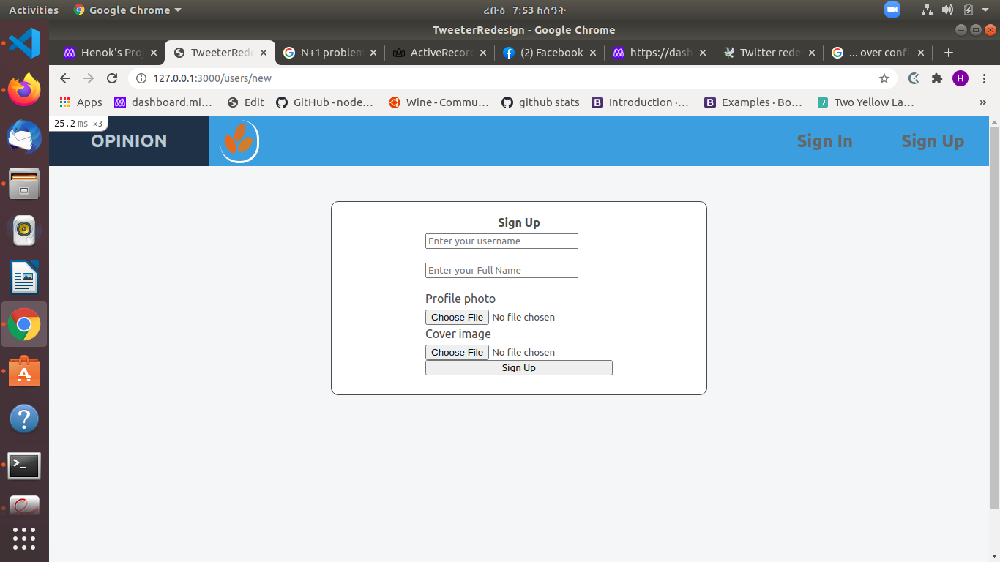
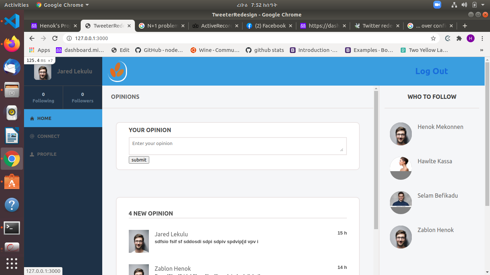
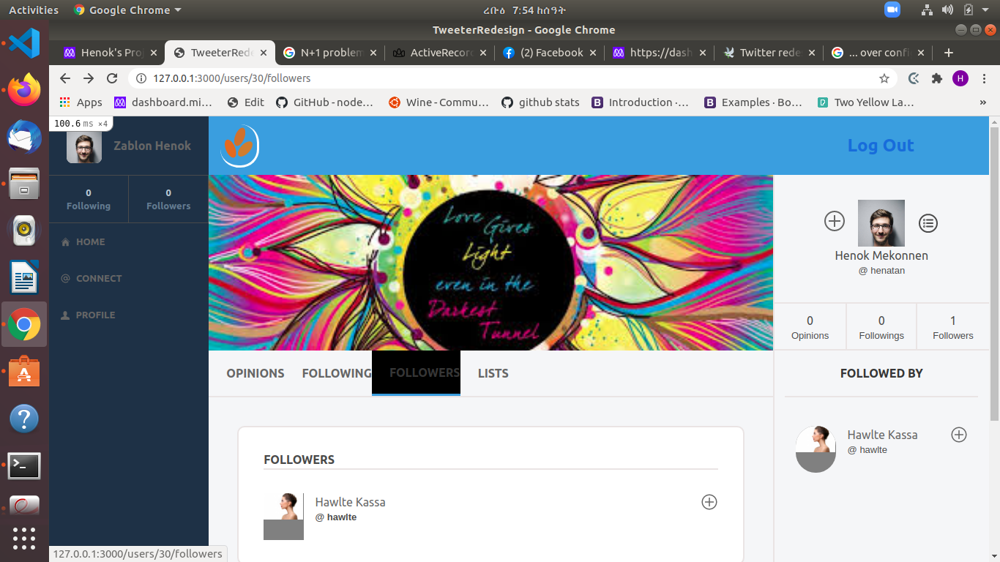
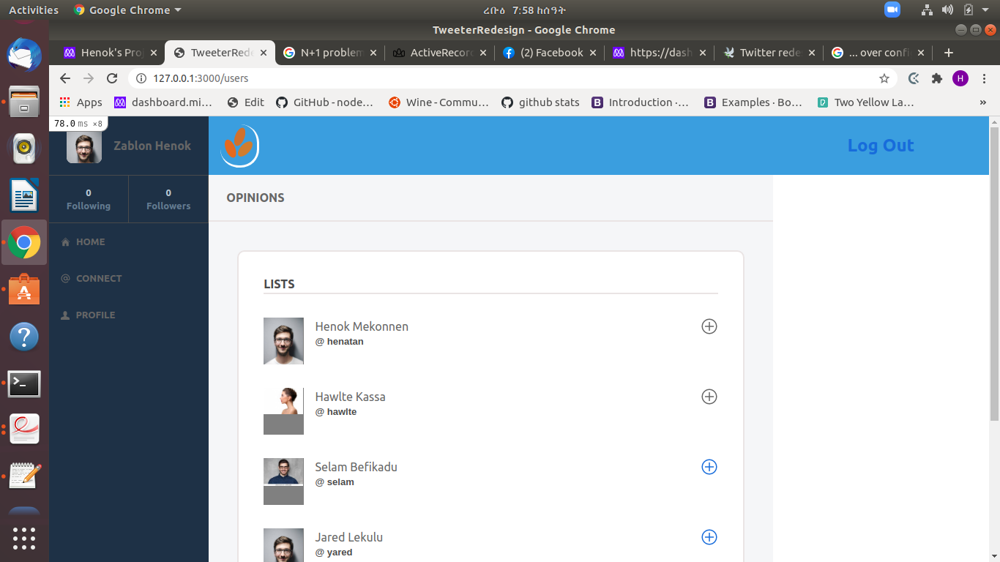

# Twitter Re-design: Rails Capstone Project 

This is a Ruby on Rails Capstone project from Microverse Ruby curriculum. The project is building an app which basically is a redesign of Twitter. Given design of the website, the app serves users to share opinions about different things. 

## Description 
The app is expected to be a minimum viable product(MVP) serving the basic functionality of the presented requirements. 
### User SignUp and Login 
The app lets new users to create user account and signup. Once user account is created a user can sign up and get all the apps users services.
- A new user is valid  if it has a unique username and a fullname present. The user can upload photo and cover images but not required for validation.




### Home Page 
Once a user is logged in it will be redirected to the home page which is the opinions index page. There, the user can see the list of all opinions posted by all users with descendin order in created time from latest to earliest.
The home page has three sections
    - the left section  has a users stat section and a navigation section
    - The stat section displays the number of followings and followers of the logged_in user
    - the navigation section has home, profile and connect links. The home link redirects to home page, the profile to the current_user show page and the connect to the users index page. 
    - The middle section has the new tweet form and the opinions section which lists all the opinions posted by all users with their profile and the time created. 
    - The right section has the who to follow list. It lists all users who are not already being followed by the current_user. 



### User show page 
The user show page has the three sections as the home page: left , middle and right sections.
    - The left side is exactly same for all the pages 
    - The middle section of the show page has 
        - A cover image of the user
        - A navigation bar with the followers, following, lists and opinion(back to user_show) links 
        - Lists of all the opinions posted by the user 
    - The right section of the show page has
        - A profile section with the user photo, user full name and username 
        - A section showing the number of opinions, followers and followings of the user
        - A followers section listing all the followers of the user    



### Users index page 
The user index page lists all the users with their profile



### Followers show page 
The followers show page is similar views as the user show page except it lists the followers of the user instead of the opinions

### Following show page
The following show page is similar views as the user show page except it lists the followed users of the user instead of the opinions

### Application layout view
The application view has a layout view with common header bar which has the profile of the current user and links 
- The profile contains the user's photo and full name 
- For a logged_in user it has a logout link 
- For a new session and new_user it has Sign In and Sign Up links

## MVC implementation 
The rails model view controller concept is implemented based on rails convention over configuration approach.

### Entity relationship diagam(ERD)
_(2).png)

### Models and associations 
Based on the ERD given, the User, Opinion and Following models are created
    - The user and opinion have one to many relationships
    - The user and following has many to many (and inverse) relationships 
    - Validations are implemented for the models 

### Database schema 
The models have their repective database schema 
    - user : username: string, fullname: string, photo: string, cover: string 
    - opinion: author_id: integer, text: text
    - following: follower_id: integer, followed_id: integer
    - Uniqueness of a following is implemented by followed_id with scope of followed_id

### Contollers and resources 
The contollers are efficeintly utilized to address the N+1 query problems. 
The controller resources used are 
    - user: index, new, create, update, detsroy, show
        with members: followers, following, follow, unfollow
    - opinion: new, edit, index
    - session: new, create, destroy 

### Uploaders 
Carrier-wave gem is used for photo and cover image uploading and writing to database 

## N+1 query problems 
To avoid N+1 database queries from web server the pre-loading of the objects variants is used before rendering views, thereby preventing unecessarily repeated queries.  
Eg:- In the user show method, we have 
    @user_opinions = @user.opinions.order('created_at DESC')
The @user_opinions is a instance variable which preloads all the opinions pposted by a user. When the user_show page is viewed, all the users opinions are stored in the @user_opinions instance variable, which avoids the need for data base queries for each opinion of the user from the view page. 


## Built With

- Ruby on Rails 
- VS code
- Carrier-wave gem 
- SASS


## Getting Started
The usage of this program is simple. 

### Prerequisites

- Ruby
- Rails 

## Setup

### running with local server 
- git clone https://github.com/henatan99/tweeter-redesign- 
- run bunddle install 
- run db:migrate 
- Once project is implemented 

**Run the code demonstrations below**

```bash
rails s 
```

**For console test demonstrations below**
```bash
rails c 
```

**For routes**
```bash
rails routes 
```
## Authors

👤 **Henok Mossissa**

- GitHub: [@henatan99](https://github.com/henatan99)
- Twitter: [@henatan99](https://twitter.com/henatan99)
- LinkedIn: [Henok Mossissa](https://www.linkedin.com/in/henok-mekonnen-2a251613/)

## :handshake: Contributing

Contributions, issues, and feature requests are welcome!

## Show your support

Give a :star:️ if you like this project!

## Acknowledgment 

- behance.com for the page designs 
- twitter for the original idea
- vectr.com for online logo development 
- Iconify for amzing icons 

## :memo: License

This project is [MIT](./LICENSE) licensed.

